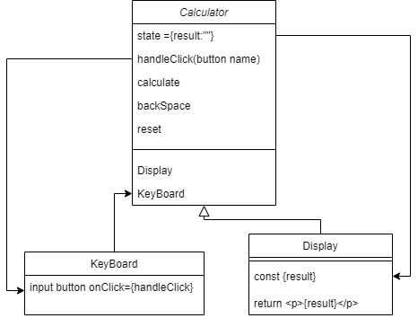
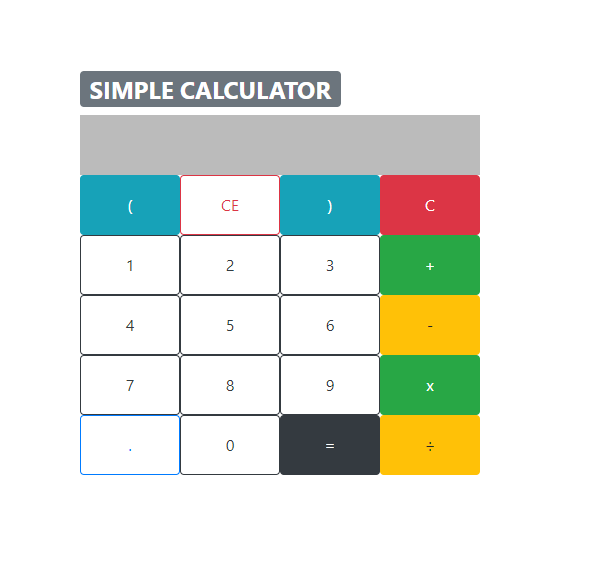

# simple calculator

> Hướng dẫn làm 1 chương trình tính toán đơn giản với react

## Ý tưởng
Nhập biểu thức bằng cách ấn nút 
Lưu biểu thức tính toán trong state 
Tính toán biểu thức bằng phương thức [eval()](https://developer.mozilla.org/en-US/docs/Web/JavaScript/Reference/Global_Objects/eval)
Hiển thị kết quả ra màn hình

## Chuẩn bị
1 parent component chứa các chức năng xử lí (handleClick(), reset(), backspace()) và các component nhỏ (Display, Keyboard) như sau:


## Thực hiện
### Tạo các component
Tạo file: `Calculator.js` chứa nội dung như sau:
```jsx
// import Display và KeyBoard
class Calculator extends React.Component{
    //khởi tạo state rỗng
    state = {
        result:""
    }

    handleClick = () => {
        //Xử lí khi ấn button
    }

    calculate = () => {
        //Tính toán biểu thức trong state result
    }

    backSpace = () => {
        //Xóa kí tự cuối cùng trong state result
    }

    reset = () => {
        //reset state result
    }

    render(){
        return (
            <div>
                <h1>CALCULATOR</h1>
                <Display reslut={this.state.result}/>
                <KeyBoard handleClick={this.handleClick}/>
            </div>
        )
    }
}
export default Calculator
```
Tạo file: `Display.js` chứa nội dung như sau:
```jsx
class Display extends React.Component{
    render(){
        //Lấy thông tin trong state result
        const {result} = this.props
        return (
            <p>{result}<p>
        )
    }
}
export default Display
```
Tạo file: `KeyBoard.js` chứa nội dung như sau:
```jsx
class KeyBoard extends React.Component{
    render(){
        return (
            <div>
                <Button name="(" onClick={e => this.props.handleClick(e.target.name)}>(</Button>
                <Button name="CE" onClick={e => this.props.handleClick(e.target.name)}>CE</Button>
                <Button name=")" onClick={e => this.props.handleClick(e.target.name)}>)</Button>
                <Button name="C" onClick={e => this.props.handleClick(e.target.name)}>C</Button><br/>


                <Button name="1" onClick={e => this.props.handleClick(e.target.name)}>1</Button>
                <Button name="2" onClick={e => this.props.handleClick(e.target.name)}>2</Button>
                <Button name="3" onClick={e => this.props.handleClick(e.target.name)}>3</Button>
                <Button name="+" onClick={e => this.props.handleClick(e.target.name)}>+</Button><br/>


                <Button name="4" onClick={e => this.props.handleClick(e.target.name)}>4</Button>
                <Button name="5" onClick={e => this.props.handleClick(e.target.name)}>5</Button>
                <Button name="6" onClick={e => this.props.handleClick(e.target.name)}>6</Button>
                <Button name="-" onClick={e => this.props.handleClick(e.target.name)}>-</Button><br/>

                <Button name="7" onClick={e => this.props.handleClick(e.target.name)}>7</Button>
                <Button name="8" onClick={e => this.props.handleClick(e.target.name)}>8</Button>
                <Button name="9" onClick={e => this.props.handleClick(e.target.name)}>9</Button>
                <Button name="*" onClick={e => this.props.handleClick(e.target.name)}>x</Button><br/>


                <Button name="." onClick={e => this.props.handleClick(e.target.name)}>.</Button>
                <Button name="0" onClick={e => this.props.handleClick(e.target.name)}>0</Button>
                <Button name="=" onClick={e => this.props.handleClick(e.target.name)}>=</Button>
                <Button name="/" onClick={e => this.props.handleClick(e.target.name)}>÷</Button><br/>
            </div>
        )
    }
}
export default KeyBoard
```
> Hàm `handleClick(btnName)` đã dc được truyển qua bởi props
Cuồi cùng chạy terminal `npm start` xem thử

## Các chức năng
### Khi ấn nút: handleClick(btnName)
Hàm này dc gọi khi nhấn vào 1 button nào đó. Nó sẽ lấy `name` của button bằng cách `event.target.name`
- Nếu: button có `name = '='` => gọi hàm `calculate()`
- Hoặc nếu: button có `name = 'C'` => gọi hàm `reset()`
- Hoặc nếu: button có `name = 'CE'` => gọi hàm `backSpace()`
- Hoặc (là các nút số và dấu): thêm `name` vào `state result` bằng cách `setState({result: this.state.result + btnName})` 
```jsx
handleClick = (btnName) => {
    if(btnName === '='){
        this.calculate()
    }else if (btnName === 'C'){
        this.reset()
    }else if (btnName === "CE"){
        this.backSpace()
    }else {
        this.setState({
            result: this.state.result + btnName
        })
    }
}
```
### Xóa 1 kí tự: backSpace()
Sử dụng [Array.prototype.slice()](https://developer.mozilla.org/vi/docs/Web/JavaScript/Reference/Global_Objects/Array/slice): Phương thức slice() trả về một bản sao tham chiếu (shallow copy) một phần của một mảng dưới dạng một mảng nhận các giá trị có chỉ số từ `begin` dến `end` (không bao gồm end). Mảng ban đầu không bị thay đổi.
Ví dụ:
```js
const animals = ['ant', 'bison', 'camel', 'duck', 'elephant'];

console.log(animals.slice(2));
// expected output: Array ["camel", "duck", "elephant"]

console.log(animals.slice(2, 4));
// expected output: Array ["camel", "duck"]

console.log(animals.slice(1, 5));
// expected output: Array ["bison", "camel", "duck", "elephant"]
```
`setState` và  `slice` để backspace với `begin = 0 và end = -1` để loại chỉ 1 phần tử cuối 
```jsx
backSpace = () => {
    this.setState({result: this.state.result.slice(0,-1)})
}
```
### Reset: reset()
không biết nói gì ngoài reset
```jsx
reset = () => {
    this.setState({result:""})
}
```
### Tính kết quả: calculate()
Sử dụng [eval()](https://developer.mozilla.org/vi/docs/Web/JavaScript/Reference/Global_Objects/Eval) để tính chuỗi biểu thức
```jsx
calculate = () => {
    this.setState({result: eval(this.state.result)})
}
```
> Tuy nhiên code trên sẽ gây ra lỗi khi tính ra số có nhiều chử số không backspace được

Các fix: như sau
`(eval(this.state.result)||"")+""`

> Lưu ý, trong các trang web không nên sử dụng `eval()` vì nó có thể ảnh hưởng đến bảo mật của trang web, đọc [Never use eval()](https://developer.mozilla.org/en-US/docs/Web/JavaScript/Reference/Global_Objects/eval#Never_use_eval!)

### Làm lại UI cho đẹp với react-bootstrap
Cài đặt react-bootstrap vào project
```terminal
npm install react-bootstrap bootstrap
```
Tiếp theo, import css của boostrap vào index.js hoặc app.js
```jsx
import 'bootstrap/dist/css/bootstrap.min.css';
```
Sao đó, dùng các [component bootstrap](https://react-bootstrap.github.io/components/alerts/) để custom giao diện cho đẹp

Ví dụ, dùng button của bootstrap
```js
import Button from 'react-bootstrap/Button'
```
sau đó sử dụng `<Button/>` thay vì `<input type='button'/>`

Hoàn thành 1 calculate lòe loẹt

